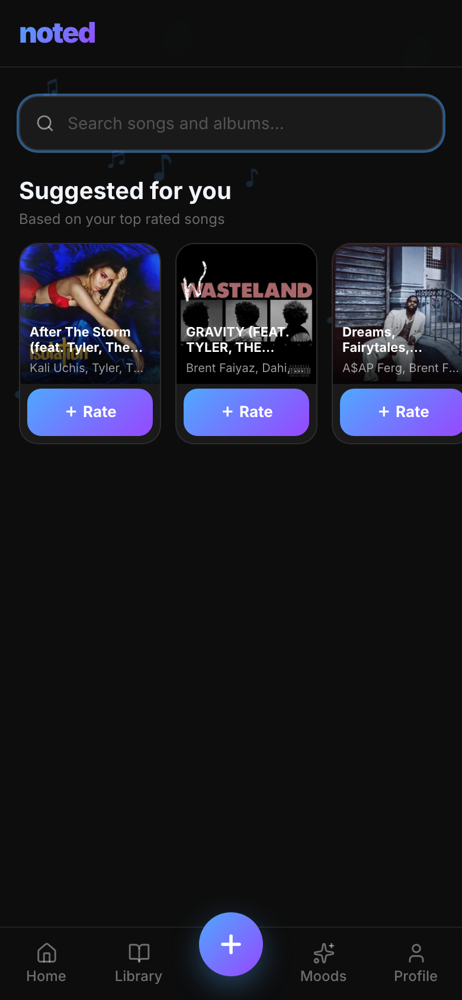
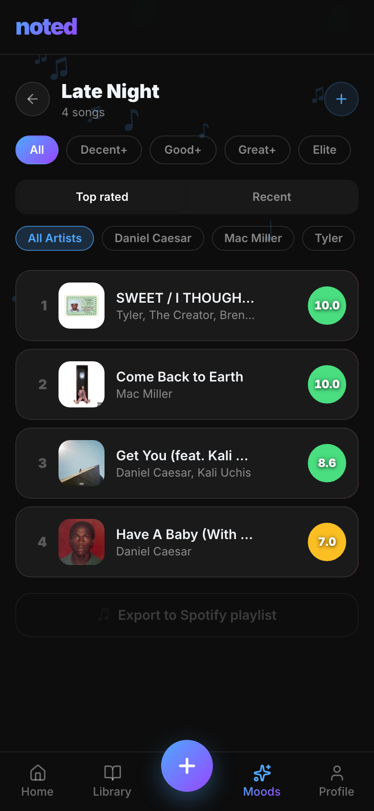
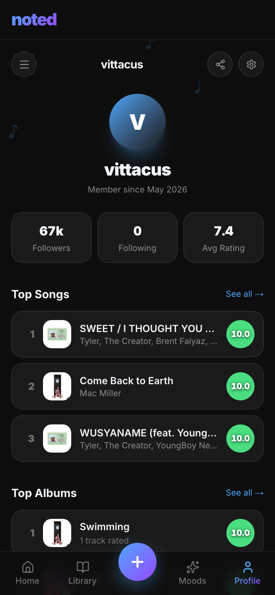
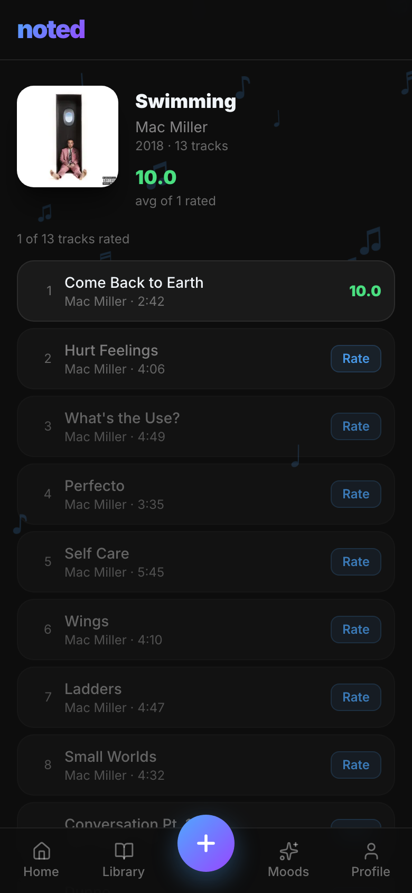
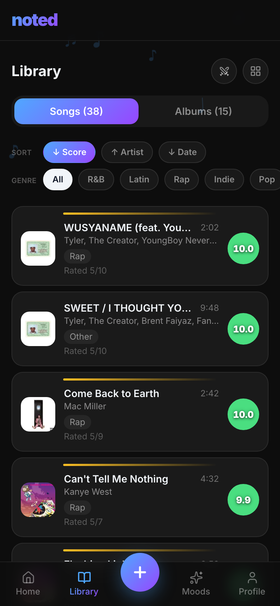
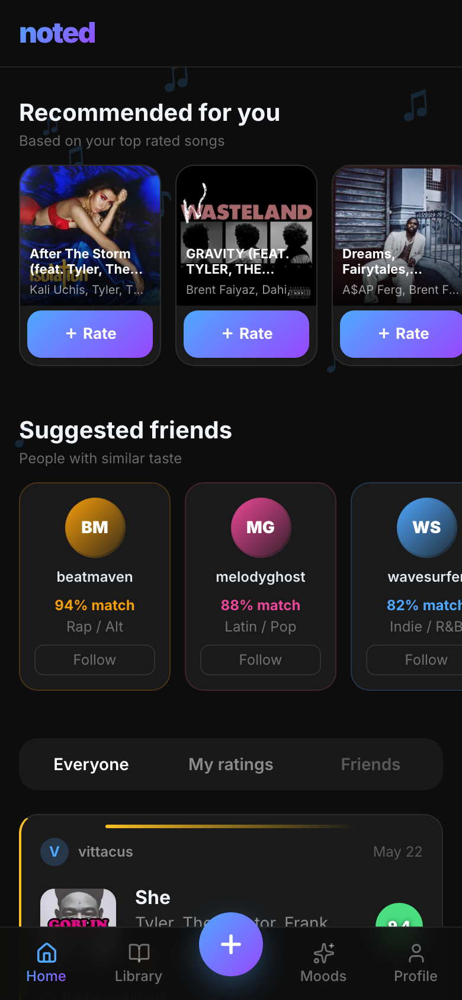

# noted

**Rate your music. Actually know your taste.**

---

## What is this?

Noted is a music rating and discovery app — think Letterboxd or Beli, but for songs. You search for any track on Spotify, rate it across three dimensions (Replay Value, Lyrics, Production), pick the vibe it fits (Late Night, Hype, Workout, Heartbreak...), and Noted builds a taste profile out of everything you've logged. The more you rate, the more your Genre DNA and Vibe DNA charts start to look like you. It's also just a really satisfying way to have opinions about music.

---

## Why I built it

I built Noted as a portfolio project to show the full product lifecycle — from writing a PRD to shipping something real people can use. Every feature decision reflects a deliberate tradeoff: what to build first, what to cut, what to simplify. The goal wasn't to build something perfect; it was to build something intentional and demonstrate how I think as a PM.

---

## Features

**Rating flow**
Search any song, then rate it across Replay Value, Lyrics, and Production (1–10 each). Pick a vibe tag, write a note if you want, and save. The overall score is a weighted average of your three dimension scores. Quick and opinionated.

  

---

**Battle Mode / ELO ranking**
Your saved songs go head-to-head in a bracket-style battle. Pick the winner and both songs get their ELO score updated — just like chess rankings. Over time this surfaces your actual favorites, not just what you rated highly in the moment.

---

**Moods**
Every song you tag (Late Night, Workout, Road Trip, etc.) gets sorted into a mood page. Tap a mood to see all your songs for that vibe, filter by score, sort by date or rating, and swipe to delete. It's basically a smart playlist that builds itself.

  

---

**Taste profile — Genre DNA + Vibe DNA**
Your profile page shows two radar charts: one for genres, one for vibes. They're built entirely from your ratings — no assumptions, no defaults. The headline at the top rotates every visit and tells you something real about your listening patterns.

  

---

**Album tracking**
Rate songs from an album and Noted tracks your progress automatically. Finish every track and you get a full celebration moment — green flash, drum roll, rolling score counter. Feels earned.

  

---

**Library**
Every song you've rated, organized in one place. Sort by score, date, or ELO rank. Filter by genre, vibe, or album. It's your personal music database.

  

---

**Recommended songs**
The home screen surfaces tracks you haven't heard based on your top-rated songs. Powered by the Spotify recommendations API seeded with your highest scores. Tap Rate directly from the card to log it without leaving the page.

  

---

**Community feed**
See what other people are rating and follow along. Leave comments on any song. The feed updates in real time and pulls in your friends' activity alongside your own recent logs.

---

## Tech stack

- **Next.js 14** — App Router, server + client components
- **Supabase** — PostgreSQL database, auth, real-time
- **Spotify Web API** — search, track metadata, recommendations
- **Tailwind CSS** — styling
- **Vercel** — deployment

---

## Live app

[noted-app-eight.vercel.app](https://noted-app-eight.vercel.app)
